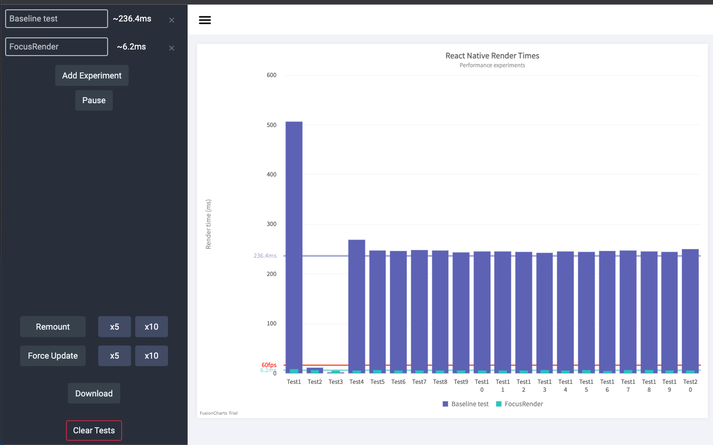

[](https://www.flagsmith.com/)

# react-navigation-focus-render

Screens within a stack or in tabs will still render when any global state(Redux/Context etc) is updated. This component lets you avoid these renders when the screens are inactive.


# Installation

``
npm i react-navigation-focus-render --save
``

# Usage

```
import FocusRender from 'react-navigation-focus-render'

const ExpensiveComponent = () => {
   const {count} = useCount(); // something that hooks into changing state
   
   return (
     <FocusRender>
       ... Components
     </FocusRender>
   ) 
}
```

# Advanced usage

You may wish to add a wrapper component that displays differently whilst the inactive component hydrates its state when the screen becomes active.

You can specify a Wrapper component that takes isFocused as a property.

```
import FocusRender from 'react-navigation-focus-render'

const Wrapper = ({isFocused, children}) => (
  <View style={{opacity: isFocused ? 1 : 0.5}}>{children}</View>
);

const ExpensiveComponent = () => {
   const {count} = useCount(); // something that hooks into changing state
   
   return (
     <FocusRender Wrapper={Wrapper}>
       ... Components
     </FocusRender>
   ) 
}
```

# Example

You can see the [example project](/example) to see this working.

HomeScreen: 

- Contains an expensive component that renders 5000 text elements and is connected to redux state "count"
- You can toggle between rendering the component via FocusRender or just by itself

TabScreen

- Contains a screen with a button that updates state "count"


Given this simple example, the difference in performance when updating state can be measured using [https://github.com/Flagsmith/react-native-performance-monitor](react-native-performance-monitor).




Of course, this is quite an extreme example but given an active stack of many tabs / screens this could easily add up if you have complex components.


